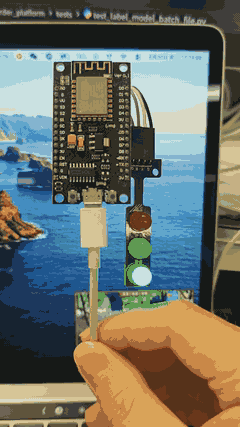

# Vibecoding Signal Light — ESP8266

> WiFi 交通信号灯，显示 AI 编程助手的工作状态。

[English](README.md) | 中文

本项目是 [vibecoding-signal-light](https://github.com/starlight36/vibecoding-signal-light) 的 ESP8266 移植版，用 ESP8266 替代 MCP2221A USB GPIO，通过 WiFi HTTP 接口控制红绿灯，Python 脚本负责向 ESP8266 发送状态通知。

## 效果演示

把信号灯放在笔记本旁边，不用盯着终端，用余光就知道 Agent 在干什么。



| 灯效 | Agent 状态 | 你该做什么 |
| --- | --- | --- |
| 绿灯常亮 | 空闲 | 不用管 |
| 绿黄红慢速循环 | 正在思考、跑工具、改文件 | 等它跑 |
| 黄灯闪烁 | 需要你看一眼 | 有空看一眼 |
| 红灯闪烁 | 需要权限、阻塞或失败 | 马上处理 |
| 绿灯短闪 | 一个会话结束 | 不用管 |
| 全灭 | 长时间空闲自动关灯 | 不用管 |

配置 Bark 后，`blocked`、`permission`、`attention` 信号会同步推送到手机，离开电脑也不会错过。

## 支持的工具

- **Claude Code** — 通过 hook 适配器自动通知
- **Codex** — 通过 hook 适配器自动通知
- **Antigravity** — 通过 hook 适配器自动通知
- **手动触发** — 通过 `signal-light` CLI 命令

## 硬件

| 零件 | 说明 |
| --- | --- |
| ESP8266 (NodeMCU / Wemos D1 Mini) | WiFi 微控制器 |
| 三色交通信号灯模型 | 红、黄、绿三路 LED |
| 3× 220Ω-1kΩ 电阻 | 限流（如果模块已内置则不需要） |
| USB 线 | 供电和初始烧录 |

## 接线

Active LOW 接法（公共正极）：

```
ESP8266 3.3V ───────────┬── 绿灯正极
                        ├── 黄灯正极
                        └── 红灯正极

绿灯负极  ── 330Ω ── D5 (GPIO14)
黄灯负极  ── 330Ω ── D6 (GPIO12)
红灯负极  ── 330Ω ── D7 (GPIO13)
```

| 信号灯 | ESP8266 引脚 | GPIO | 说明 |
| --- | --- | --- | --- |
| 绿灯 | D5 | GPIO14 | 空闲 |
| 黄灯 | D6 | GPIO12 | 需要关注 |
| 红灯 | D7 | GPIO13 | 权限、阻塞或失败 |
| 有效电平 | LOW | — | `digitalWrite(pin, LOW)` = 灯亮 |

### 引脚选择理由

D5/D6/D7 都是可靠的通用 GPIO，支持 PWM（用于软脉冲亮度控制），无启动模式冲突。

避免的引脚：GPIO0（启动模式）、GPIO2（启动模式）、GPIO15（启动时需下拉）、GPIO16（无 PWM）。

详细的接线说明请参考 [docs/wiring.md](docs/wiring.md)。

## 快速开始

### 1. 烧录固件

```bash
cd firmware
# 安装 PlatformIO CLI (如果没有)
pip install platformio

# 编译并烧录
pio run -t upload

# 查看串口日志
pio device monitor
```

### 2. 配置 WiFi

首次启动（或 WiFi 连接失败时），ESP8266 会创建一个热点：

- **热点名称**: `Signal-Light-Setup`
- 连接后会自动弹出配网页面（Captive Portal）
- 选择你的 WiFi，输入密码
- 保存后 ESP8266 自动连接

### 3. 安装 Python 客户端

```bash
cd client
uv sync

# 测试连接
uv run signal-light list
uv run signal-light status
```

### 4. 安装 Hook

```bash
# 自动安装所有支持的 agent hook
cd client
uv run signal-light install-hooks --all -y

# 或只安装 Claude Code
uv run signal-light install-hooks --agent claude-code -y

# 或只安装 Codex
uv run signal-light install-hooks --agent codex -y

# 或只安装 Antigravity
uv run signal-light install-hooks --agent antigravity -y
```

### 5. 配置 Bark 推送通知（可选）

[Bark](https://github.com/Finb/Bark) 是 iOS 推送通知服务。配置后，关键信号会自动推送到手机。

```bash
# 复制模板并填入你的 Bark key
cp client/.env.example client/.env
# 编辑 client/.env，将 YOURKEY 替换为你的 Bark key

# 测试通知
uv run signal-light bark-test
```

Shell 脚本会自动加载 `client/.env`，无需手动 export。你也可以在 shell 中临时覆盖：

```bash
export BARK_SERVER_URL=https://api.day.app/YOURKEY
```

### 6. 使用

```bash
# 手动发送信号
uv run signal-light play working
uv run signal-light play permission
uv run signal-light play idle

# 查看状态
uv run signal-light status

# 测试红黄绿
uv run signal-light test

# 测试 Bark 推送
uv run signal-light bark-test

# 清除所有状态
uv run signal-light reset
```

## 设备发现

Python 客户端按以下顺序查找 ESP8266：

1. **mDNS** — 自动解析 `signal-light.local`（需要 ESP8266 和电脑在同一局域网）
2. **环境变量** — `SIGNAL_LIGHT_HOST=<ip>` 手动指定

```bash
# 手动指定 IP
export SIGNAL_LIGHT_HOST=192.168.1.100
uv run signal-light status
```

## HTTP API

ESP8266 运行 HTTP 服务器，可以直接用 `curl` 测试：

```bash
# 发送信号
curl -X POST http://signal-light.local/signal \
  -H 'Content-Type: application/json' \
  -d '{"signal":"working","session_id":"test1"}'

# 查看状态
curl http://signal-light.local/status

# 重置
curl -X POST http://signal-light.local/reset
```

### POST /signal

```json
{
  "signal": "working",
  "session_id": "abc123"
}
```

支持的信号名：`idle`, `thinking`, `working`, `tool_done`, `attention`, `permission`, `blocked`, `done`, `session_start`, `session_end`, `session_done`, `off`, `turn_end`

### GET /status

```json
{
  "aggregate": "working",
  "pattern": "work_cycle",
  "sessions": {
    "abc123": {"signal": "working", "age_seconds": 42}
  }
}
```

### POST /reset

清除所有会话，关闭所有灯。

## 环境变量

| 变量 | 默认值 | 说明 |
| --- | --- | --- |
| `SIGNAL_LIGHT_HOST` | (空) | 手动指定 ESP8266 IP，当 mDNS 不可用时使用 |
| `SIGNAL_LIGHT_USE_UV` | `0` | 设为 `1` 时 shell 脚本通过 `uv run` 执行 |
| `BARK_SERVER_URL` | (空) | Bark 推送地址，如 `https://api.day.app/YOURKEY` |
| `BARK_NOTIFY_SIGNALS` | `blocked,permission,attention` | 触发 Bark 推送的信号列表，逗号分隔 |

推荐将以上变量写入 `client/.env` 文件，shell 脚本会自动加载。模板文件：`client/.env.example`。

## 项目结构

```
vibe-coding-signal-light-esp8266/
├── firmware/
│   ├── platformio.ini          # PlatformIO 配置
│   ├── include/config.h        # 引脚和时序常量
│   └── src/main.cpp            # ESP8266 固件
├── client/
│   ├── pyproject.toml
│   ├── .env.example            # 环境变量模板
│   ├── signal_light/
│   │   ├── agent_signals.py    # 灯语信号定义
│   │   ├── esp.py              # HTTP 客户端 + mDNS 发现
│   │   ├── bark.py             # Bark 推送通知
│   │   ├── claude_code_hook.py # Claude Code hook 适配器
│   │   ├── codex_hook.py       # Codex hook 适配器
│   │   ├── hook_installer.py   # Hook 安装向导
│   │   └── cli.py              # CLI 入口
│   ├── scripts/                # Shell 脚本封装
│   └── tests/                  # 单元测试
├── docs/
│   └── wiring.md               # 接线文档
└── README.md
```

## Claude Code 集成

Claude Code 通过 stdin 传入 JSON hook 数据：

```bash
echo '{"event":"PreToolUse","session_id":"demo"}' | ./scripts/claude-code-signal-hook
echo '{"event":"PermissionRequest","session_id":"demo"}' | ./scripts/claude-code-signal-hook
echo '{"event":"Notification","session_id":"demo"}' | ./scripts/claude-code-signal-hook
```

| Claude Code 事件 | 灯效行为 |
| --- | --- |
| `SessionStart` | 绿灯空闲 |
| `UserPromptSubmit` | 工作循环 |
| `PreToolUse` | 工作循环 |
| `PostToolUse` | 工作循环 |
| `PostToolUseFailure` | 红灯闪烁 |
| `Notification` | 黄灯闪烁 |
| `PermissionRequest` | 红灯闪烁 |
| `Stop` | 清理普通工作态 |
| `SessionEnd` | 绿灯短闪提示完成 |

## Codex 集成

```bash
./scripts/codex-signal-hook UserPromptSubmit
./scripts/codex-signal-hook PreToolUse
./scripts/codex-signal-hook PermissionRequest
./scripts/codex-signal-hook Stop
```

| Codex 事件 | 灯效行为 |
| --- | --- |
| `SessionStart` | 绿灯空闲 |
| `UserPromptSubmit` | 工作循环 |
| `PreToolUse` | 工作循环 |
| `PostToolUse` | 工作循环 |
| `PermissionRequest` | 红灯闪烁 |
| `Stop` | 清理普通工作态 |
| `SessionEnd` | 绿灯短闪提示完成 |

## Antigravity 集成

```bash
./scripts/antigravity-signal-hook PreToolUse
./scripts/antigravity-signal-hook PostToolUse
./scripts/antigravity-signal-hook PreInvocation
./scripts/antigravity-signal-hook Stop
```

| Antigravity 事件 | 灯效行为 |
| --- | --- |
| `PreToolUse` | 工作循环（根据工具类型可能触发权限/关注提醒） |
| `PostToolUse` | 工具完成（出错时红灯阻塞） |
| `PreInvocation` | 思考中 |
| `PostInvocation` | 工具完成 |
| `Stop` | 阻塞（出错）/ 会话完成（空闲）/ 本轮结束 |

## 多会话行为

ESP8266 维护每个会话的状态，按优先级聚合显示：

```
红灯闪烁 > 黄灯闪烁 > 工作循环 > 绿灯常亮
```

一个会话等待权限时，即使另一个会话开始工作，红灯也不会被覆盖。

## WiFi 重新配置

如果需要更换 WiFi 网络：

1. 长按 ESP8266 的 FLASH/RST 按钮重置
2. 或在串口监视器中发送特定命令清除 WiFi 配置
3. ESP8266 会重新进入热点配网模式

## 与参考项目的区别

| 方面 | 参考项目 (MCP2221A) | 本项目 (ESP8266) |
| --- | --- | --- |
| 硬件控制 | Python EasyMCP2221 库，USB GPIO | HTTP POST 到 ESP8266 WiFi 服务器 |
| 动画 | Python 后台 worker 进程 | ESP8266 固件 millis() 状态机 |
| 会话状态 | /tmp/signal-light/ JSON 文件 | ESP8266 内存数组 |
| Python 依赖 | EasyMCP2221 | 无（仅 stdlib） |
| 设备发现 | 本地 USB | mDNS + 环境变量回退 |
| 配网 | 无 | WiFiManager 热点配网 |
| 亮度控制 | 布尔开/关 | 10-bit PWM 软脉冲 |

## 运行测试

```bash
cd client
uv sync
uv run pytest tests/ -v
```

## License

[MIT](LICENSE)
